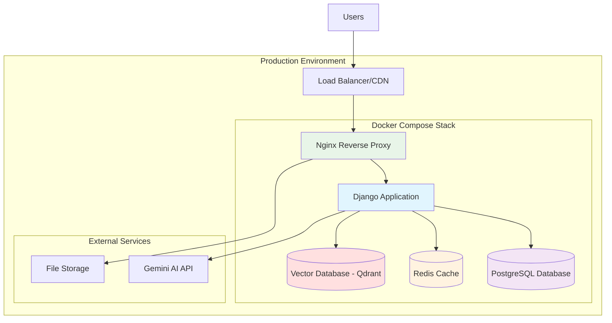

# Design Document

## Overview

This design document outlines the architecture and implementation approach for deploying the Django FAQ/RAG system to production environments. The solution uses Docker containerization, PostgreSQL database, Nginx reverse proxy, and production-optimized Django settings to ensure reliable, secure, and scalable deployment.

## Architecture

The production deployment follows a multi-container architecture:



## Components and Interfaces

### 1. Docker Container Architecture

**Multi-Stage Dockerfile:**
- **Build Stage**: Installs dependencies, compiles assets
- **Production Stage**: Minimal runtime image with only necessary components
- **Base Image**: Python 3.11-slim for security and size optimization

**Container Specifications:**
- Application runs as non-root user for security
- Health checks for container orchestration
- Graceful shutdown handling
- Environment-based configuration

### 2. Django Application Configuration

**Production Settings Module:**
```python
# settings/production.py structure
- Database: PostgreSQL with connection pooling
- Static Files: WhiteNoise with compression and caching
- Security: HTTPS enforcement, security headers
- Logging: Structured logging with proper levels
- Caching: Redis for session and cache storage
```

**Environment Variable Management:**
- Required variables validation at startup
- Secure secret management
- Environment-specific overrides
- Default fallback values where appropriate

### 3. Database Layer

**PostgreSQL Configuration:**
- Version: PostgreSQL 15+ for performance and features
- Connection pooling via Django database settings
- Persistent storage using Docker volumes
- Automated migrations during deployment
- Backup-friendly configuration

**Vector Database (Qdrant):**
- Dedicated vector database for embeddings storage
- Persistent storage for vector data
- REST API for vector operations
- Optimized for similarity search
- Separate from main PostgreSQL database

**Data Persistence:**
- Named Docker volumes for database data
- Separate volumes for static files and media
- Vector database persistent storage
- Volume backup strategies for production

### 4. Web Server Layer

**Nginx Reverse Proxy:**
- Static file serving with efficient caching
- Request forwarding to Django application
- SSL termination and HTTPS enforcement
- Security headers implementation
- Rate limiting and DDoS protection

**Configuration Features:**
- Gzip compression for text assets
- Browser caching for static resources
- Request size limits for security
- Custom error pages
- Health check endpoints

### 5. Application Server

**Gunicorn WSGI Server:**
- Multi-worker process model
- Worker count based on CPU cores
- Graceful worker restarts
- Request timeout configuration
- Memory usage monitoring

**Performance Optimizations:**
- Preloading application code
- Worker recycling for memory management
- Connection keep-alive settings
- Request buffering configuration

### 6. Vector Database and Embedding System

**Qdrant Vector Database:**
- Dedicated vector database for storing FAQ embeddings
- High-performance similarity search capabilities
- REST API for vector operations
- Persistent storage for vector data
- Automatic collection management

**Embedding Pipeline:**
- Local embedding model (all-MiniLM-L6-v2) for consistent results
- Batch processing for efficient embedding generation
- Automatic re-embedding when FAQ content changes
- Fallback mechanisms when embedding service is unavailable

**RAG System Reliability:**
- Health checks for embedding service availability
- Graceful degradation when vector database is unavailable
- Fallback to traditional text search when embeddings fail
- Proper error handling to prevent "I don't know" responses

**Production Embedding Configuration:**
- Pre-computed embeddings stored in Qdrant
- Embedding model loaded once at startup
- Connection pooling for vector database
- Monitoring and alerting for embedding service health

## Data Models

### Environment Configuration Schema

```python
class EnvironmentConfig:
    # Database Configuration
    DATABASE_URL: str  # PostgreSQL connection string
    DB_NAME: str
    DB_USER: str
    DB_PASSWORD: str
    DB_HOST: str
    DB_PORT: int = 5432
    
    # Application Settings
    SECRET_KEY: str
    DEBUG: bool = False
    ALLOWED_HOSTS: List[str]
    
    # External Services
    GEMINI_API_KEY: str
    GEMINI_MODEL: str = "gemini-2.0-flash-exp"
    
    # RAG Configuration
    RAG_EMBEDDING_TYPE: str = "local"
    RAG_LOCAL_EMBEDDING_MODEL: str = "all-MiniLM-L6-v2"
    RAG_VECTOR_DIMENSION: int = 384
    RAG_SIMILARITY_THRESHOLD: float = 0.5
    
    # Vector Database Configuration
    QDRANT_HOST: str = "qdrant"
    QDRANT_PORT: int = 6333
    QDRANT_COLLECTION_NAME: str = "faq_embeddings"
    VECTOR_DB_URL: str  # Qdrant connection URL
    
    # Cache Configuration
    REDIS_URL: str
    CACHE_TTL: int = 3600
    
    # Security Settings
    CSRF_TRUSTED_ORIGINS: List[str]
    SECURE_SSL_REDIRECT: bool = True
    SECURE_HSTS_SECONDS: int = 31536000
```

### Docker Compose Service Definitions

```yaml
# Service architecture
services:
  nginx:
    image: nginx:alpine
    ports: ["80:80", "443:443"]
    volumes: [static_files, nginx_config]
    
  app:
    build: .
    environment: [production_env_vars]
    volumes: [static_files, media_files]
    depends_on: [db, redis]
    
  db:
    image: postgres:15-alpine
    environment: [db_env_vars]
    volumes: [postgres_data]
    
  qdrant:
    image: qdrant/qdrant:latest
    ports: ["6333:6333"]
    volumes: [qdrant_data]
    
  redis:
    image: redis:7-alpine
    volumes: [redis_data]
```

## Correctness Properties

*A property is a characteristic or behavior that should hold true across all valid executions of a system-essentially, a formal statement about what the system should do. Properties serve as the bridge between human-readable specifications and machine-verifiable correctness guarantees.*

### Container and Build Properties

**Property 1: Container Dependency Completeness**
*For any* Docker build of the application, all Python dependencies listed in requirements.txt should be successfully installed and available in the container
**Validates: Requirements 1.1**

**Property 2: Automatic Migration Execution**
*For any* container startup with database connectivity, all pending Django migrations should be automatically applied before the application becomes ready
**Validates: Requirements 1.2**

**Property 3: Production Configuration Loading**
*For any* deployment with DJANGO_ENV=production, the container should load production-specific settings and disable development features
**Validates: Requirements 1.3**

**Property 4: Static File Serving Efficiency**
*For any* request to static file URLs, Nginx should serve the files directly with appropriate caching headers without forwarding to Django
**Validates: Requirements 1.4**

**Property 5: Multi-stage Build Optimization**
*For any* production Docker image build, the final image should not contain build tools, source code, or development dependencies
**Validates: Requirements 1.5**

### Application Configuration Properties

**Property 6: Database Backend Selection**
*For any* production environment configuration, the Django application should use PostgreSQL as the database backend, not SQLite
**Validates: Requirements 2.1**

**Property 7: WhiteNoise Static File Middleware**
*For any* Django application startup, WhiteNoise should be properly configured in the middleware stack for static file serving
**Validates: Requirements 2.2**

**Property 8: Production Error Handling**
*For any* application error in production mode (DEBUG=False), error responses should not expose sensitive information like stack traces or settings
**Validates: Requirements 2.3**

**Property 9: Environment Variable Validation**
*For any* application startup, missing required environment variables should cause startup failure with clear, descriptive error messages
**Validates: Requirements 2.4**

**Property 10: HTTPS Enforcement**
*For any* HTTP request in production, the application should redirect to HTTPS and set appropriate security headers
**Validates: Requirements 2.5**

### Database Properties

**Property 11: PostgreSQL Version Compliance**
*For any* database connection, the PostgreSQL version should be 15.0 or higher
**Validates: Requirements 3.1**

**Property 12: Connection Pooling Configuration**
*For any* database connection establishment, the Django application should use connection pooling settings for efficient resource management
**Validates: Requirements 3.2**

**Property 13: Migration Automation**
*For any* deployment process, all Django migrations should be automatically applied to the database before the application serves requests
**Validates: Requirements 3.3**

**Property 14: Backup Tool Compatibility**
*For any* PostgreSQL database instance, standard PostgreSQL backup tools (pg_dump, pg_restore) should work correctly
**Validates: Requirements 3.4**

**Property 15: Data Persistence**
*For any* container restart or recreation, database data should persist through Docker volumes
**Validates: Requirements 3.5**

### Environment and Security Properties

**Property 16: Environment Variable Configuration**
*For any* deployment environment (dev/staging/prod), all configuration should be loaded from environment variables, not hardcoded values
**Validates: Requirements 4.1**

**Property 17: Secret Management**
*For any* sensitive configuration (API keys, passwords), values should be loaded from environment variables and never appear in logs or error messages
**Validates: Requirements 4.2**

**Property 18: Startup Validation**
*For any* application startup, all required environment variables should be validated, and missing variables should prevent startup with clear error messages
**Validates: Requirements 4.3**

**Property 19: Configuration Error Handling**
*For any* invalid configuration value, the application should fail fast during startup with descriptive error messages
**Validates: Requirements 4.4**

**Property 20: Multi-Environment Support**
*For any* environment type (development, staging, production), the configuration system should load appropriate settings based on environment variables
**Validates: Requirements 4.5**

### Web Server and Orchestration Properties

**Property 21: Request Forwarding**
*For any* HTTP request to application endpoints, Nginx should successfully forward the request to the Django application
**Validates: Requirements 5.1**

**Property 22: Direct Static File Serving**
*For any* static file request, Nginx should serve the file directly without forwarding to Django, and include appropriate caching headers
**Validates: Requirements 5.2**

**Property 23: SSL Configuration**
*For any* HTTPS-enabled deployment, Nginx should enforce HTTPS redirects and implement proper SSL configuration
**Validates: Requirements 5.3**

**Property 24: Large File Handling**
*For any* file upload within configured size limits, Nginx should handle the upload efficiently without errors
**Validates: Requirements 5.4**

**Property 25: Security Headers Implementation**
*For any* HTTP response, Nginx should include security headers (HSTS, CSP, X-Frame-Options) and implement rate limiting
**Validates: Requirements 5.5**

**Property 26: Service Orchestration**
*For any* docker-compose up command, all defined services (nginx, app, db, redis) should start successfully and reach ready state
**Validates: Requirements 6.1**

**Property 27: Startup Dependency Order**
*For any* service startup, dependent services should wait for their dependencies (app waits for db, nginx waits for app)
**Validates: Requirements 6.2**

**Property 28: Port Exposure**
*For any* successful deployment, the application should be accessible on the configured external port
**Validates: Requirements 6.3**

**Property 29: Internal Service Communication**
*For any* inter-service communication, services should be able to communicate using Docker Compose service names
**Validates: Requirements 6.4**

**Property 30: Configuration Environment Support**
*For any* deployment configuration (development or production), Docker Compose should support the appropriate environment-specific settings
**Validates: Requirements 6.5**

### Performance and Security Properties

**Property 31: Gunicorn Multi-Worker Configuration**
*For any* application server startup, Gunicorn should run with multiple workers based on CPU core count
**Validates: Requirements 7.1**

**Property 32: Static File Caching**
*For any* static file served by the application, appropriate caching headers should be set for browser and proxy caching
**Validates: Requirements 7.2**

**Property 33: Application Preloading**
*For any* Gunicorn startup, application code should be preloaded to improve response times
**Validates: Requirements 7.3**

**Property 34: Memory Usage Limits**
*For any* running application instance, memory usage should stay within configured limits and not cause container OOM kills
**Validates: Requirements 7.4**

**Property 35: Graceful Shutdown and Health Checks**
*For any* shutdown signal or health check request, the application should respond appropriately and handle graceful shutdowns
**Validates: Requirements 7.5**

**Property 36: Debug Mode Disabled**
*For any* production deployment, Django DEBUG setting should be False and debug information should not be exposed
**Validates: Requirements 8.1**

**Property 37: CSRF Protection**
*For any* POST request without proper CSRF token, the application should reject the request with appropriate error response
**Validates: Requirements 8.2**

**Property 38: Security Headers**
*For any* HTTP response, security headers (HSTS, CSP, X-Content-Type-Options, etc.) should be present
**Validates: Requirements 8.3**

**Property 39: Environment Variable Secret Loading**
*For any* API key or secret configuration, values should be loaded from environment variables and not hardcoded in source code
**Validates: Requirements 8.4**

**Property 40: Host Validation**
*For any* HTTP request with invalid Host header, the application should reject the request when not in the ALLOWED_HOSTS list
**Validates: Requirements 8.5**

### Vector Database and Embedding Properties

**Property 41: Vector Database Connectivity**
*For any* application startup, the Qdrant vector database should be accessible and respond to health checks
**Validates: Requirements 3.5, 4.1**

**Property 42: Embedding Model Loading**
*For any* application startup, the local embedding model should be successfully loaded and ready for inference
**Validates: Requirements 2.1, 4.1**

**Property 43: FAQ Embedding Storage**
*For any* FAQ entry in the system, corresponding embeddings should be stored in the vector database with proper metadata
**Validates: Requirements 3.5, 4.1**

**Property 44: Similarity Search Functionality**
*For any* user query, the vector database should return relevant FAQ embeddings based on similarity threshold
**Validates: Requirements 2.1, 4.1**

**Property 45: Embedding Service Fallback**
*For any* embedding service failure, the system should gracefully fall back to traditional text search instead of returning "I don't know"
**Validates: Requirements 2.3, 4.4**

**Property 46: Vector Database Persistence**
*For any* container restart, vector embeddings should persist through Docker volumes and remain accessible
**Validates: Requirements 3.5**

## Error Handling

### Container and Build Errors
- **Build Failures**: Clear error messages for missing dependencies or build issues
- **Startup Failures**: Detailed logging for configuration or database connection problems
- **Health Check Failures**: Proper container restart policies and failure notifications

### Application Errors
- **Database Connection Errors**: Retry logic with exponential backoff
- **Environment Variable Errors**: Fail-fast with specific missing variable information
- **Static File Errors**: Fallback mechanisms and proper 404 handling

### Infrastructure Errors
- **Service Communication Failures**: Circuit breaker patterns and retry mechanisms
- **Resource Exhaustion**: Proper limits and graceful degradation
- **Security Violations**: Logging and alerting for security-related failures

### Vector Database and Embedding Errors
- **Vector Database Connection Failures**: Automatic retry with exponential backoff
- **Embedding Model Loading Failures**: Clear error messages and fallback to text search
- **Similarity Search Failures**: Graceful degradation to keyword-based search
- **Embedding Generation Errors**: Retry mechanisms and error logging
- **"I Don't Know" Response Prevention**: Multiple fallback layers to ensure meaningful responses

## Testing Strategy

### Unit Testing
- **Configuration validation tests**: Verify environment variable loading and validation
- **Database connection tests**: Test PostgreSQL connectivity and migration execution
- **Security configuration tests**: Verify HTTPS enforcement and security headers
- **Static file serving tests**: Test WhiteNoise configuration and file serving

### Integration Testing
- **Container build tests**: Verify Docker images build successfully with all dependencies
- **Service orchestration tests**: Test Docker Compose startup and service communication
- **End-to-end deployment tests**: Full deployment testing in staging environment
- **Performance tests**: Load testing with multiple Gunicorn workers

### Property-Based Testing
- **Configuration property tests**: Test configuration loading across different environments
- **Security property tests**: Verify security measures work across various inputs
- **Performance property tests**: Test resource usage stays within limits
- **Deployment property tests**: Verify deployment consistency across environments
- **Vector database property tests**: Test embedding storage, retrieval, and similarity search
- **RAG system property tests**: Test fallback mechanisms and response quality

Each property-based test should run a minimum of 100 iterations to ensure comprehensive coverage. Tests should be tagged with the format: **Feature: production-deployment, Property {number}: {property_text}**

<function_calls>
<invoke name="prework">
<parameter name="featureName">production-deployment